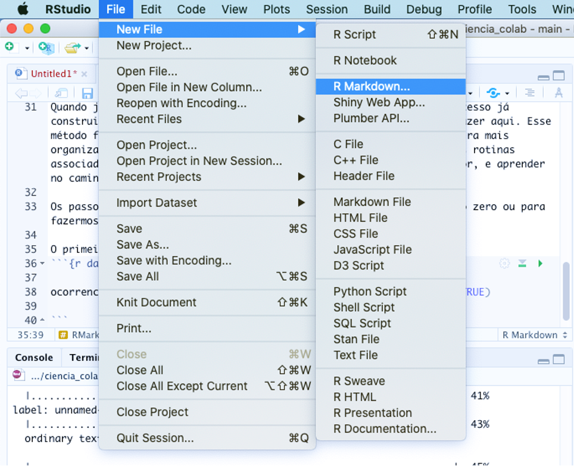
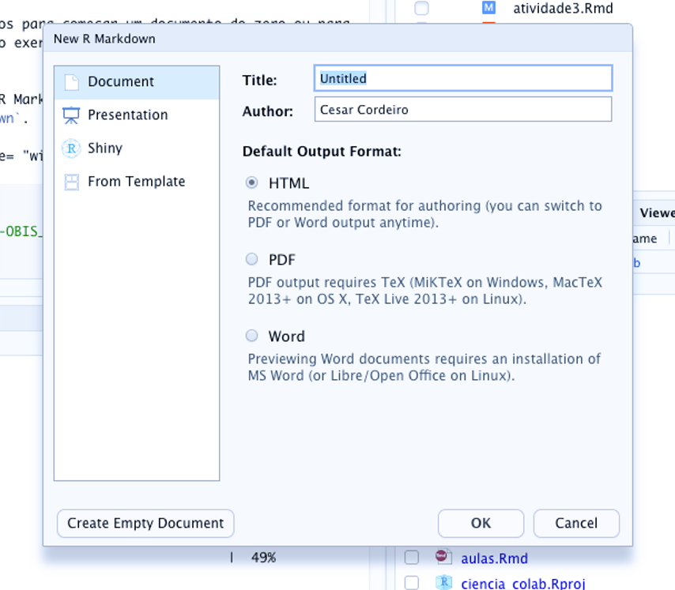
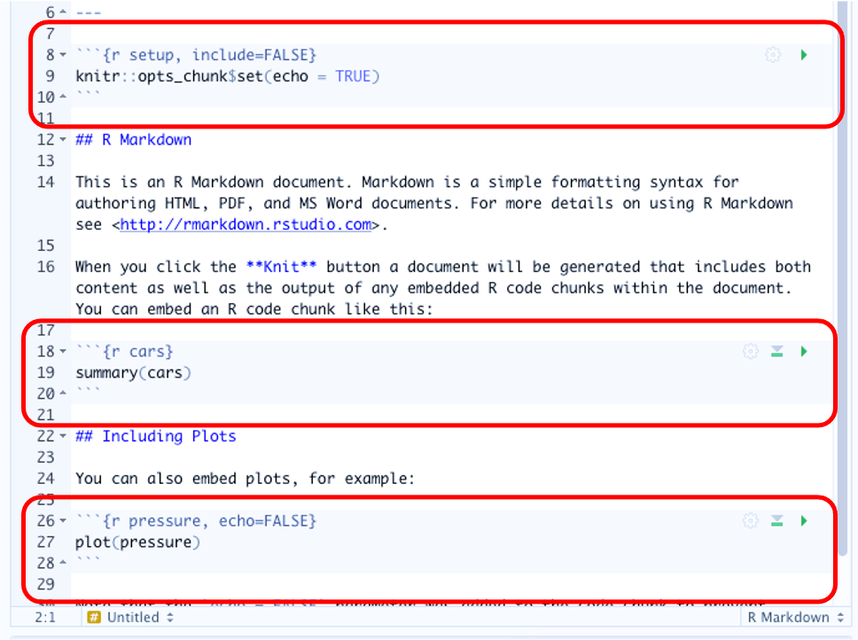
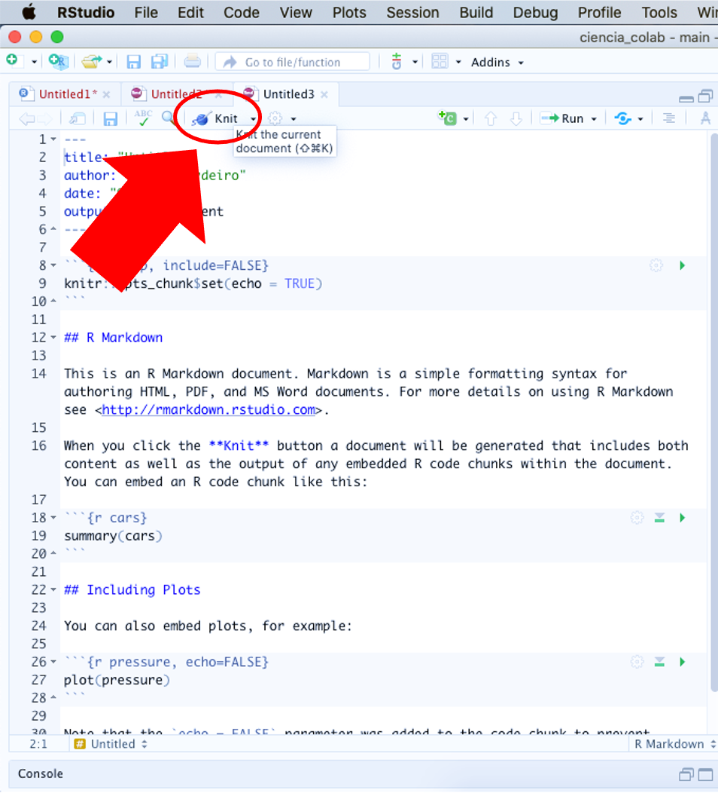
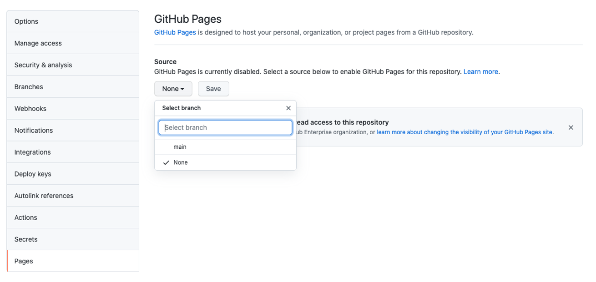
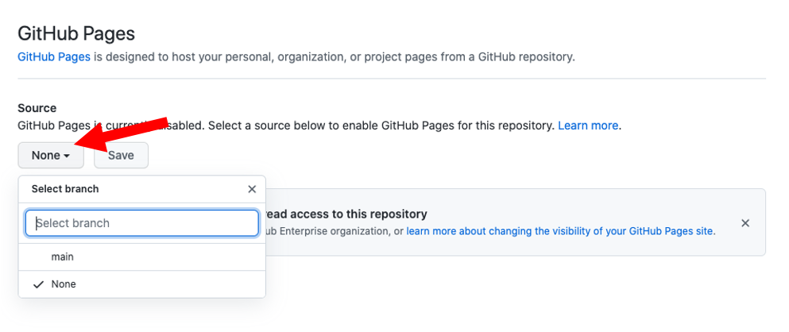
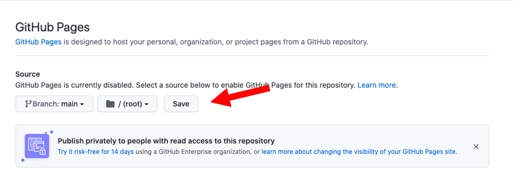
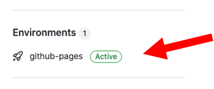
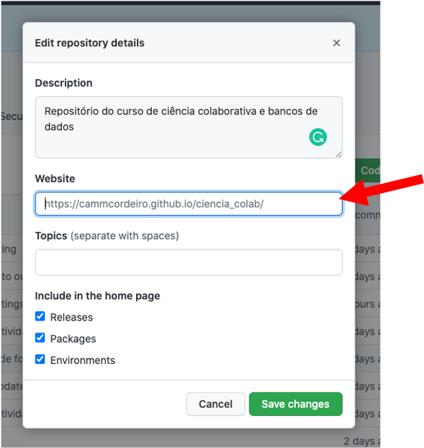
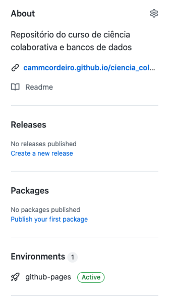

# **Atividade 5** {.unnumbered}

A atividade 5 vai incluir algumas ferramentas para podermos para podermos criar roteiros que incluem texto e análises mesclados em um só documento. Isso facilita o compartilhamento entre colaboradores.

  

## `R Markdown` {.unnumbered}

Esta atividade consiste em tranformar a rotina criada nos exercícios anteriores em um formato mais amigável de ser compartilhado. Muitas vezes criamos o próprio estilo ao construir rotinas e deixamos alguns detalhes e explicações de lado. No entanto,
para que outras pessoas possam construir em conjunto é importante que todos os detalhes estejam descritos na rotina. Os documentos no formato `markdown` permitem mesclar trechos de texto com códigos, o que facilita muito a explicação dos passos utilizados para criarmos documentos, explicar o racional de análises em uma pesquisa, produzir conteúdo
didático e outros. Quando já entendemos o formato `R Markdown` iremos iniciar todo o processo já construindo este documento e não transferindo o código como iremos fazer aqui. Esse método foi escolhido para mostrar que além de podermos criar de maneira mais organizada nossas futuras rotinas, podemos lidar com um 'passivo' das rotinas associadas a
trabalhos mais antigos para podermos nos organizar melhor, e aprender no caminho.

Os passos aplicados aqui serão os mesmos para começar um documento do zero ou para fazermos essa transferência proposta no exercício.   

-   O primeiro passo é criar um documento R Markdown no RStudio. Para
    isso, clique no menu `File` -\> `New file` -\> `R Markdown`.

  

-   Em seguida, escolhemos o tipo de *output* (vamos usar o padrão
    HTML), dar um nome ao arquivo (**atividade4**) e clicar em `OK`.

  

-   O documento criado já apresenta um exemplo com o cabeçalho e alguns
    `chunks` de código.

  

Antes mesmo de editarmos o documento, podemos ter um ideia de como será
sua versão final clicando no botão `Knit` no alto da tela de comandos.

  

-   Agora, vamos limpar o documento e começar a inserir nossos próprios
    `chuncks` de código utilizado no *script* de algum exercício anterior.
    Em seguida, basta copiar os trechos de código já criados dentro de
    cada `chunk` seguindo uma lógica dos passos utilizados em cada
    etapa.

Mas não se esqueça, daqui pra frente, já pode começar seu documentos direto como `R Markdown`.   

Um complemento e uma boa prática para o compartilhamento de dados é a utilização de ferramentas de colaboração como o [git](https://git-scm.com) e o [GitHub](https://github.com). Para se aprofundar no assunto, você pode começar por este [tutorial](https://cammcordeiro.github.io/ciencia_colab/atividade4.html#42_GitHub) ou buscar mais informações na internet.   

## **Extra** {.unnumbered}

Caso você já tenha se aventurado pelo GitHub ou tenha feito o tutorial indicado acima, vamos passar para uma atividade extra que, além de facilitar o compartilhamento, dá visibilidade aos documentos gerados por você por meio de um *website* hospedado no GitHub e completamente gratuito.

O [Github Pages](<https://pages.github.com>) permite que você construa websites simples a partir de seu repositório Github. Para ativar esse recurso, acesse a guia **Settings** em
`https://github.com/SEU_USUÁRIO/SEU_REPOSITORIO`. Em seguida, clique no
menu **Pages** na barra de navegação do lado esquerdo.

   

No botão abaixo de **Source**, escolha o **Branch** **main** e folder
**/(root)**:

   

Click **Save**. You should now see that the site is "ready to be
published":

   

Olhando no menu principal do repositório, você poderá confirmar que o
repositório está ativo na forma de website

   

E também poderá acessar a página no endereço:

-   `https://SEU_USUÁRIO.github.io/SEU_REPOSITORIO`

Repare que o URL é apenas uma reordenação do endereço do repositório no
Github:

-   `https://github.com/SEU_USUÁRIO/SEU_REPOSITORIO`

Para ficar mais fácil de encontrarem o website, clique na ícone de
engrenagem em frente a palavra **About** no menu do lado direito e uma
janela irá abrir:

   

O endereço do website irá aparecer em cinza, mas você terá que digitar
ou copiar e colar o endereço neste campo. Basta salvar e já poderá ver o
endereço na página principal do repositório.

Ao final, você deve ver algo como isso:

   

***

