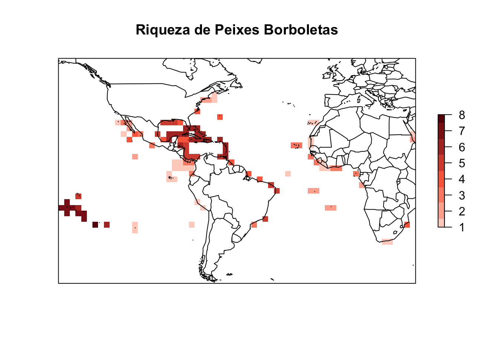
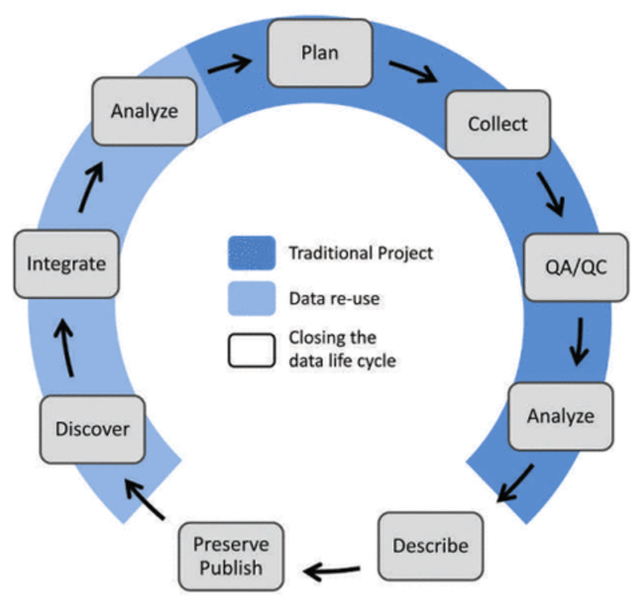

```{=html}
<style>
body {
text-align: justify}
</style>
```
## **Atividade 1**  {.unnumbered}


#### *Exercícios de cálculo de índices de diversidade com dados de bases abertas*  {.unnumbered}

<center>{width="550"}</center>

A [**atividade 1**](atividade_1.html) consiste em um exercício de mapas de distribuição a partir de bases abertas, neste caso, com dados do repositório da *International Union for Conservation of Nature* [IUCN](http://www.iucnredlist.org/technical-documents/spatial-data).

<br><br>

------------------------------------------------------------------------

## **Atividade 2** {.unnumbered}

#### *Exercícios de verificação de padrões de distribuição de espécies* {.unnumbered}

<center></center>


A [**atividade 2**](atividade2.html) 
.
<br><br>

------------------------------------------------------------------------

## **Atividade 3** {.unnumbered}

#### *Exercícios de redes de interação* {.unnumbered}

<center></center>

<br><br>


A [**atividade 3**](atividade3.html) .
<br><br>

------------------------------------------------------------------------

## **Atividade 4** {.unnumbered}

#### *Exercícios de cálculo de indicadores de diversidade funcional* {.unnumbered}

<center></center>

<br><br>

A [**atividade 4**](atividade4.html).
<br><br>

------------------------------------------------------------------------

## **Atividade 5** {.unnumbered}

#### *Exercícios de checagem de qualidade, padronização e roteiro reprodutível de aquisição e análise de dados macroecológicos* {.unnumbered}

<center></center>

<br><br>

A [**atividade 5**](atividade5.html) finaliza o processo de ferramentas básicas de compartilhamento e reprodutibilidade de dados científicos.
Nesta atividade, os participantes irão tranformar as rotinas criadas nas atividades anteriores em um website.
<br><br>

------------------------------------------------------------------------
