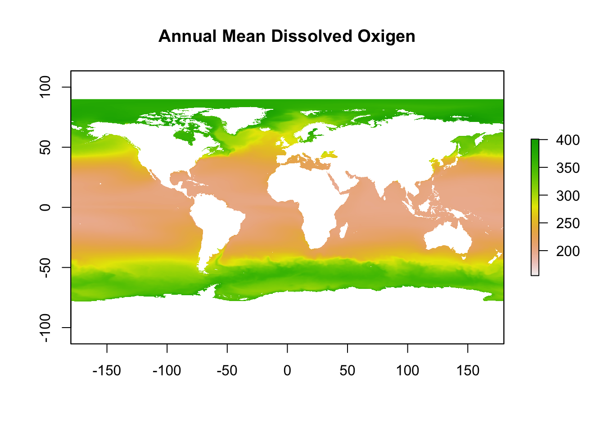

```{=html}
<style>
body {
text-align: justify}
</style>
```
## **Atividade 1** {.unnumbered}

#### *Exercícios de cálculo de índices de diversidade com dados de bases abertas* {.unnumbered}

<center>{width="550"}</center>

A [**atividade 1**](atividade_1.html) consiste em um exercício de mapas de distribuição a partir de bases abertas, neste caso, com dados do repositório da *International Union for Conservation of Nature* [IUCN](https://www.iucnredlist.org/resources/spatial-data-download).

<br><br>

------------------------------------------------------------------------

## **Atividade 2** {.unnumbered}

#### *Exercícios de verificação de padrões de distribuição de espécies* {.unnumbered}

<center>{width="500"}</center>

A [**atividade 2**](atividade_2.html) utilizará o mapa gerado na atividade 1 e camadas de dados abióticos para investigarmos relações entre características das espécies analisadas e gradientes ambientais.
<br><br>

------------------------------------------------------------------------

## **Atividade 3** {.unnumbered}

#### *Exercícios de redes de interação* {.unnumbered}

<center>{width="500"}</center>

<br><br>

Na [**atividade 3**](atividade_3.html) iremos aplicar ferramentas básicas de construção de redes de interação análise de grafos.
<br><br>

------------------------------------------------------------------------

## **Atividade 4** {.unnumbered}

#### *Exercícios de cálculo de indicadores de diversidade filogenética e funcional* {.unnumbered}

<center>{width="600"}</center>

<br><br>

A [**atividade 4**](atividade_4.html) inclui uma análise das relações filogenéticas dos peixes-borboleta e um cálculo básico de descritores funcionais.
<br><br>

------------------------------------------------------------------------

## **Atividade 5** {.unnumbered}

#### *Exercícios de confecção de roteiro reprodutível de aquisição e análise de dados macroecológicos* {.unnumbered}

<center></center>

<br><br>

A [**atividade 5**](Atividade_5.html) é um adicional de ferramentas básicas de compartilhamento e reprodutibilidade de dados científicos.
Nesta atividade, os participantes irão tranformar as rotinas criadas nas atividades anteriores em documento reprodutível.
<br><br>

------------------------------------------------------------------------
