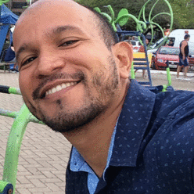
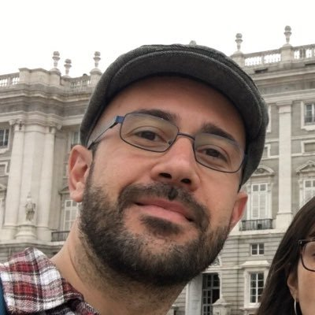

```{=html}
<style>
body {
text-align: justify}
</style>
```
## Macroecologia Marinha {.unnumbered}

------------------------------------------------------------------------

Durante o curso usaremos o método de ensino construtivo, o qual coloca o aluno no centro do processo de aprendizado, desempenhando um papel ativo ao buscar conhecimento à medida que os conteúdos são transmitidos em sala de aula virtual. Para alcançar este objetivo, pretendemos por meio de exercícios práticos colocar os estudantes em situações próximas da atividade de pesquisa, para facilitar a compreensão de conceitos teóricos. Por conta do momento atual, a disciplina foi reformulada e será realizada de forma totalmente remota contando com atividades síncronas e assíncronas. <br><br>

Todas as aulas teóricas serão realizadas de forma presencial e as aulas práticas terão momentos de interação com os professores e de trabalho autônomo dos participantes.

-   Duração: 08:30-12:30 / 14:00 - 18:00
-   Dias: 07, 08, 09, 28, 29 e 30 de novembro <br><br>

**Avaliações**

-   Atividades síncronas
-   Atividades assíncronas
-   Debates (seminários)
-   Avaliação final (trabalho autoral)

<br><br>

### *Instrutores* {.unnumbered}

+-------------------------------------------+-------------------------------------------------------------------+
| {width="104"} | Dr. Cesar A M M Cordeiro                                          |
|                                           |                                                                   |
|                                           | Professor associado ao Laboratório de Ciências Ambientais da UENF |
|                                           |                                                                   |
|                                           | Lattes: <http://lattes.cnpq.br/6383192984652602>                  |
|                                           |                                                                   |
|                                           | contato: [cesarcordeiro\@uenf.br](mailto:cesarcordeiro@uenf.br)   |
+-------------------------------------------+-------------------------------------------------------------------+
| {width="104"}    | Dr. Juan Pablo Quimbayo                                           |
|                                           |                                                                   |
|                                           | Pós-doutorando no CEBIMar/USP                                     |
|                                           |                                                                   |
|                                           | Website: <https://quimbayojp.weebly.com/>                         |
|                                           |                                                                   |
|                                           | contato: [quimbayo.j.p\@gmail.com](mailto:quimbayo.j.p@gmail.com) |
+-------------------------------------------+-------------------------------------------------------------------+
| {width="104"}  | Dr. Thiago C Mendes                                               |
|                                           |                                                                   |
|                                           | Pós-doutorando no CEBIMar/USP                                     |
|                                           |                                                                   |
|                                           | Lattes: <http://lattes.cnpq.br/5438502345033506>                  |
|                                           |                                                                   |
|                                           | contato: [tcmendes\@gmail.com](mailto:tcmendes@gmail.com)         |
+-------------------------------------------+-------------------------------------------------------------------+

<br><br>

### *Referências recomendadas* {.unnumbered}

------------------------------------------------------------------------

**Leituras básicas:**

-   Brown.J.H. (1995) Macroecology. The University of Chicago Press, Chicago.

-   Lomolino, M.V., Riddle, B.R. & Brown, J.H. (2005) Biogeography, 3rd Edition. Sinauer Associates.

-   Magurran AE & May RM (1999) Evolution of biological diversity. Oxford University Press, Oxford.

-   Ricklefs RE & Schluter D (2001) Species diversity in ecological communities: historical and geographical perspectives. University of Chicago Press, USA. 414p.

-   Witman JD, Roy K (2009) Marine macroecology. The University of Chicago Press, Chicago.

**Leituras complementares (seminários):**

-   Bellmaker J & Jetz W (2015) Relative roles of ecological and energetic constraints, diversification rates and region history on global species richness gradients. Ecology Letter [doi: 10.1111/ele.12438]

-   Bowen et al. (2013). The origins of tropical marine biodiversity. TREE, 28, 359-366. - Brum et al. (2017). Global priorities for conservation across multiple dimensions of mammalian diversity. PNAS 114(29): 7641-7646

-   Gaston KJ (2000) Global patterns in biodiversity. Nature 405, 220-227. van der Hoogen et al. (2019). Soil nematode abundance and functional group composition at the global scale. Nature [doi: 10.1038/s41586-019-1418-6]

-   Jetz W et al. (2019) Essential biodiversity variables for mapping and monitoring species populations. Nature Ecology and Evolution [doi: 10.1038/s41559-019-0826-1]

-   McGill B et al. (2006). Rebuilding community ecology from functional traits. TREE, 2, 178-185.

-   Mouillot et al (2013). A functional approach reveals community responses to disturbances. TREE, 28, 167-177.

-   Orme D et al. (2005) Global hotspots of species richness are not congruent with endemism or threat. Nature 436, 10161019.

-   Pineda J, Reyns N (2018) Larval transport in the coastal zone: Biological and physical processes. In: Carrier TJ, Reitzel AM, Heyland A (eds) Evolutionary ecology of marine invertebrate larvae. Oxford University Press, Pp 143-159.

-   Whittaker RJ, et al. (2017) Island biogeography: Taking the long view of nature's laboratories. Sciences 357, 885.

------------------------------------------------------------------------
